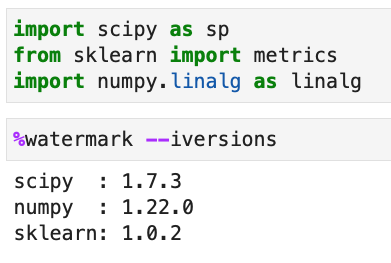

[](https://ci.appveyor.com/project/rasbt/watermark)
[](http://badge.fury.io/py/watermark)


# watermark

An IPython magic extension for printing date and time stamps, version numbers, and hardware information.
<br>

#### Sections

- [Examples](#examples)
- [Installation and updating](#installation-and-updating)
- [Usage](#usage)
- [Development guidelines](#development-guidelines)
- [Changelog](#changelog)

<br>

## Examples

[[top](#sections)]

### Using watermark in  Jupyter notebooks and IPython sessions




**More examples can be found in this [Jupyter notebook](docs/watermark.ipynb).**

[](https://mybinder.org/v2/gh/rasbt/watermark/master?filepath=docs%2Fwatermark.ipynb)

<br>


### Using watermark as a module


```python
from watermark import watermark
print(watermark())
```

```
Last updated: 2022-09-13T16:28:56.177487-05:00

Python implementation: CPython
Python version       : 3.9.13
IPython version      : 8.4.0

Compiler    : Clang 13.0.1 
OS          : Darwin
Release     : 21.6.0
Machine     : arm64
Processor   : arm
CPU cores   : 10
Architecture: 64bit
```

```python
print(watermark(packages="numpy,scipy"))
```

```
numpy: 1.23.2
scipy: 1.9.1
```


See `help(watermark)` for more options.


## Installation and updating

[[top](#sections)]

The watermark line magic can be installed by executing

```bash
pip install watermark
```

Alternatively, you can install the latest development version directly from GitHub via

```bash
pip install -e git+https://github.com/rasbt/watermark#egg=watermark
```

<br>

Note:

To remove an old `watermark` installation (installed via the deprecated `%install_ext` magic extension), simply delete it from the ``.ipython/extensions/`` directory, which is typically located in a user's home directory.

## Usage

[[top](#sections)]

After successful installation, the `watermark` magic extension can be loaded via:

```python
%load_ext watermark
```

<br>

To get an overview of all available commands, type:

```python
%watermark?
```

<br>

```raw
  %watermark [-a AUTHOR] [-gu GITHUB_USERNAME] [-e EMAIL] [-ws WEBSITE]
                 [-d] [-n] [-t] [-i] [-z] [-u] [-c CUSTOM_TIME] [-v]
                 [-p PACKAGES] [-co] [-h] [-m] [-g] [-r] [-b] [-w] [-iv]

IPython magic function to print date/time stamps
and various system information.

optional arguments:
  -a AUTHOR, --author AUTHOR
                        prints author name
  -gu GITHUB_USERNAME, --github_username GITHUB_USERNAME
                        prints author github username
  -e EMAIL, --email EMAIL
                        prints author email
  -ws WEBSITE, --website WEBSITE
                        prints author or project website
  -d, --date            prints current date as YYYY-mm-dd
  -n, --datename        prints date with abbrv. day and month names
  -t, --time            prints current time as HH-MM-SS
  -i, --iso8601         prints the combined date and time including the time
                        zone in the ISO 8601 standard with UTC offset
  -z, --timezone        appends the local time zone
  -u, --updated         appends a string "Last updated: "
  -c CUSTOM_TIME, --custom_time CUSTOM_TIME
                        prints a valid strftime() string
  -v, --python          prints Python and IPython version
  -p PACKAGES, --packages PACKAGES
                        prints versions of specified Python modules and
                        packages
  -co, --conda          prints name of current conda environment
  -h, --hostname        prints the host name
  -m, --machine         prints system and machine info
  -g, --githash         prints current Git commit hash
  -r, --gitrepo         prints current Git remote address
  -b, --gitbranch       prints current Git branch
  -w, --watermark       prints the current version of watermark
  -iv, --iversions      prints the name/version of all imported modules
```

<br>

## Development guidelines

[[top](#sections)]

In line with [NEP 29][nep-29], this project supports:

- All minor versions of Python released 42 months prior to the project, and at minimum the two latest minor versions.

[nep-29]: https://numpy.org/neps/nep-0029-deprecation_policy.html

<br>

## Changelog

[[top](#sections)]

#### v. 2.4.0 (May 23, 2023)

- Adds a new `--gpu` flag to print out GPU information (currently limited to NVIDIA devices) ([#90](https://github.com/rasbt/watermark/pull/63), via contribution by [907Resident](https://github.com/907Resident))


#### v. 2.3.1 (May 27, 2022)

- Upper limit on importlib-metadata caused trouble installing on Python 3.7.
  Instead pin to minimum version with Python 3.8 functionality according to https://github.com/python/importlib_metadata#compatibility  ([#86](https://github.com/rasbt/watermark/pull/63), via contribution by [James Myatt](https://github.com/jamesmyatt))

#### v. 2.3.0 (January 3, 2022)

- Added the following arguments: `--github_username` - for prints author github username, `--email` - for prints author email, `--website` - for prints author or project website. ([#82](https://github.com/rasbt/watermark/pull/82), via contribution by [joschkazj](https://github.com/joschkazj))
- Added a `--conda` option to print the name of the current conda environment. ([#79](https://github.com/rasbt/watermark/pull/79), via contribution by [Alexander Krasnikov](https://github.com/askras))
-  It is now possible to inject globals when used outside IPython ([#80](https://github.com/rasbt/watermark/pull/80), via contribution by [
Hugo Lapré](https://github.com/Hugovdberg)). For example, version numbers of imported packages can now be obtained as follows: 

```python
import numpy
import watermark.watermark as watermark


watermark(iversions=True, globals_=globals())
```

#### v. 2.2.0 (February 17, 2021)

- Refactoring such that a `watermark()` function now also works outside IPython and Jupyter. Now, the magic `%watermark` calls `watermark()`. Calling `%watermark` via IPython and Juypter still works as usual. However, in addition the `watermark()` function can be used within regular Python for unit testing purposes etc. ([#46](https://github.com/rasbt/watermark/pull/46), via contribution by [Tymoteusz Wołodźko](https://github.com/twolodzko))

#### v. 2.1.0 (November 23, 2020)

- Adopt [NEP 29][nep-29] and require Python version 3.7 or newer. ([#63](https://github.com/rasbt/watermark/pull/63), via contribution by [James Myatt](https://github.com/jamesmyatt))
- Add Python 3.8 and 3.9 to Travis CI builds. ([#63](https://github.com/rasbt/watermark/pull/63), via contribution by [James Myatt](https://github.com/jamesmyatt))
- Fix: Allow setup.py to run without install_requires already installed ([#67](https://github.com/rasbt/watermark/pull/67), via contribution by [James Myatt](https://github.com/jamesmyatt))
- Major refactoring to improve code readability ([#64](https://github.com/rasbt/watermark/pull/64) and [65](https://github.com/rasbt/watermark/pull/65), via contribution by [Bahram Aghaei](https://github.com/GreatBahram))
- Use importlib and importlib.metadata to determine package version numbers. ([#66](https://github.com/rasbt/watermark/pull/66), via contribution by [James Myatt](https://github.com/jamesmyatt))

#### v. 2.0.2 (November 19, 2019)

- Support `VERSION` attributes, in addition to `__version__` attributes.

#### v. 2.0.1 (October 04, 2019)

- Fix `'sklearn'` vs. `'scikit-learn'` import compatibility.

#### v. 2.0.0 (October 04, 2019)

- Now uses `pkg_resources` as the default method for getting version numbers.
- Fixes a whitespace bug when printing the timezone.

#### v. 1.8.2 (July 28, 2019)

- When no Python library was imported and the `--iversion` is used, print an empty string instead of raising an error.

#### v. 1.8.1 (January 26, 2019)

- Fixes string alignment issues when the `-iv`/`--iversion` flag is used.

#### v. 1.8.0 (January 02, 2019)

- The `-iv`/`--iversion` flag now also shows package versions that were imported as `from X import Y`
and `import X.Y as Y`. For example,

```python
import scipy as sp
from sklearn import metrics
import numpy.linalg as linalg
```

```
%watermark --iversions
```

will return

```
scipy     1.1.0
sklearn   0.20.1
numpy     1.15.4
```

#### v. 1.7.0 (October 13, 2018)

(Via contribution by [James Myatt](https://github.com/jamesmyatt))

- Shows "not installed" for version of packages/modules that cannot be imported.
- Shows "unknown" for version of packages/modules when version attribute cannot be found.
- Add Python 3.6 and 3.7 to Travis CI builds.
- Add classifiers to setuptools configuration.

#### v. 1.6.1 (June 10, 2018)

- Now also includes the LICENSE file in the Python Wheels distribution

#### v. 1.6.0 (Jan uary18, 2018)

- Adds a new `-b`/`--gitbranch` parameter that prints the current Git branch.

#### v. 1.5.0 (August 27, 2017)

- Adds a new `-iv`/ `--iversions` parameter that prints the package names and version numbers of all packages that were previously imported in the current Python session. (Via contribution by [Aziz Alto](https://github.com/iamaziz))

#### v. 1.4.0 (April 18, 2017)

- Adds a new `-r`/ `--gitrepo` parameter that returns the URL of Git remote name "origin". (Via contribution by [Lucy Park](https://github.com/e9t))

#### v. 1.3.4 (October 15, 2016)

- Allow fetching scikit-learn's version number via `-p scikit-learn` in addition of `-p sklearn` (the former is deprecated and will not be supported in watermark > 1.7).

#### v. 1.3.3 (September 1, 2016)

- Includes LICENSE in MANIFEST.in for packaging

#### v. 1.3.2 (August 16, 2016)

- Fixes an issue where the wrong package info was obtained when using the system level Jupyter within a virtualenv environment. (Via contribrution by [Michael Bell](https://github.com/mrbell))
- Adds a new `-i`/ `--iso8601` parameter that returns the current date-time string in ISO 8601 format with offset to UTC. For instance: `2016-08-16T18:03:42-04:00`. Current caveat: Python < 3.2 requires external libraries for for computing the timezone offset, thus, Python < 3.2 will currently only print `2016-08-16T18:03:42`
- Adds offsets to UTC to the default date-time string for Python >= 3.2

#### v. 1.3.1 (June 6, 2016)

- Fixes an issue that caused problems importing watermark using Python 2.x

#### v. 1.3.0 (May 21, 2016)

- Removed the deprecated the %install_ext magic so that watermark can now be installed as a regular python package via `pip` (Via contribution by [Peter Bull](https://github.com/pjbull))

#### v. 1.2.3 (January 29, 2016)

- Changed date format to the unambiguous ISO-8601 format
- Ditched the deprecated %install_ext function and made watermark a proper Python package
- Released the new version under a more permissive newBSD [license](./LICENSE)

#### v. 1.2.2 (June 17, 2015)

- Changed the default date-format of `-d`, `--date` to MM/DD/YYYY, the format DD/MM/YYYY can be used via the shortcut `-e`, `--eurodate`.

#### v. 1.2.1 (March 3, 2015)

- Small bugfix to allow custom time string formatting.

#### v. 1.2.0 (October 1, 2014)

- `--watermark` command added to print the current version of watermark.
- Print author name on a separate line
- Fixed bug that day takes the same value as the minute if the `-n` flag is used.
