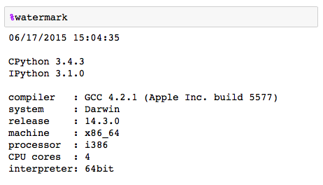
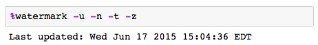
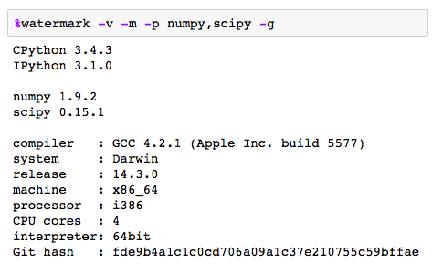

watermark
=========

An IPython magic extension for printing date and time stamps, version numbers, and hardware information

 
#### Contents

- [Examples](#examples)
- [Installation and updating](#installation-and-updating)
- [Usage](#usage)
- [Changelog](#changelog)

 
 

## Examples
[[back to contents](#contents)]

For more examples can be found in this [IPython notebook](http://nbviewer.ipython.org/github/rasbt/watermark/blob/master/docs/watermark.ipynb).

 
 

## Installation and updating
[[back to contents](#contents)]

In order to intall `watermark`, execute the the following code snippet in an IPython shell or IPython notebook cell.

	%install_ext https://raw.githubusercontent.com/rasbt/watermark/master/watermark.py
	
For updates, simply execute the `%install_ext` again. Information about the current watermark version can be found in the help menu (via `%watermark?`).

 
 	
	
## Usage
[[back to contents](#contents)]

After successful installation, the `watermark` magic extension can be loaded via:

	%load_ext watermark

 
 	
	
To get an overview of all available commands, type:

	%watermark?
	
 

	%watermark [-a AUTHOR] [-d] [-n] [-t] [-z] [-u] [-c CUSTOM_TIME] [-v]
	                 [-p PACKAGES] [-h] [-m] [-g]

	IPython magic function to print date/time stamps 
	and various system information.

	watermark version 1.1.0

	optional arguments:
	  -a AUTHOR, --author AUTHOR
	                        prints author name
	  -d, --date            prints current date
	  -n, --datename        prints date with abbrv. day and month names
	  -t, --time            prints current time
	  -z, --timezone        appends the local time zone
	  -u, --updated         appends a string "Last updated: "
	  -c CUSTOM_TIME, --custom_time CUSTOM_TIME
	                        prints a valid strftime() string
	  -v, --python          prints Python and IPython version
	  -p PACKAGES, --packages PACKAGES
	                        prints versions of specified Python modules and
	                        packages
	  -h, --hostname        prints the host name
	  -m, --machine         prints system and machine info
	  -g, --githash         prints current Git commit has  	  
	  -w, --watermark       prints the current version of watermark
	  

 
 

## Changelog
[[back to contents](#contents)]

#### v. 1.2.1 (Mar 3, 2015)
- Small bugfix to allow custom time string formatting.

#### v. 1.2.0 (Oct 01, 2014)
- `--watermark` command added to print the current version of watermark.
- Print author name on a separate line
- Fixed bug that day takes the same value as the minute if the `-n` flag is used.